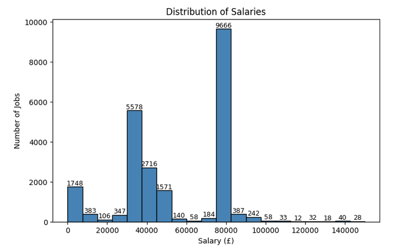
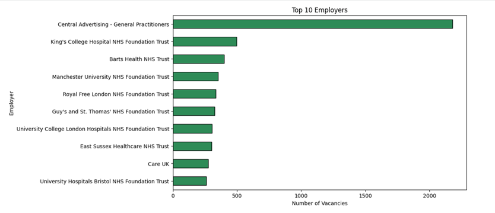
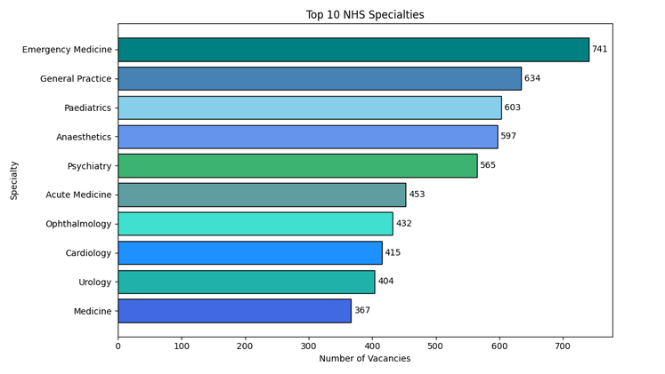
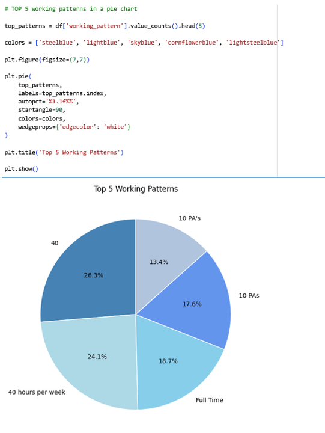
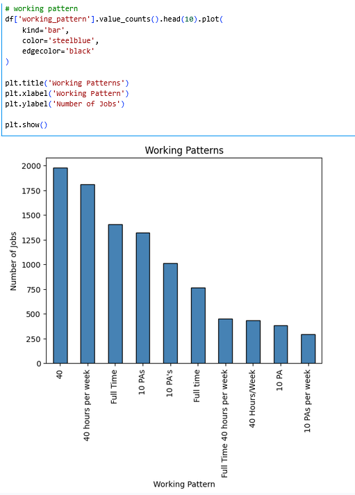

# NHS Jobs Analysis (Python)

I created this project to practise using Python to analyse a real-world dataset.
Using Pandas and Matplotlib, I explored NHS job vacancy data to understand salary distribution, the most common job specialties, the largest employers, and different working patterns.

---
## Visualisations

### Salary Distribution

### Top 10 NHS Employers

### Top 10 NHS Specialties

### Top 5 Working Patterns

### Working Patterns

---

## Dataset

The project uses an **NHS Jobs** dataset containing information about job vacancies, salaries, employers, specialties and working patterns.

Before starting the analysis, I checked the data for missing values and duplicates. I also cleaned the salary column by removing text values and converting it into a numeric format so it could be analysed.

**Source:** Kaggle – NHS Jobs Dataset

---

## Tools Used

- Python
- Pandas
- NumPy
- Matplotlib
- Google Colab

---

## Key Findings

Some of the main insights from the analysis include:

- Most NHS jobs were in the lower and middle salary ranges.
- Some NHS organisations advertised many more vacancies than others.
- Emergency Medicine, General Practice and Paediatrics had the highest number of vacancies.
- Full-time jobs were the most common working pattern in the dataset.

---

## What I Learned

This project helped me improve my Python and data analysis skills.

The biggest challenge was cleaning the salary data because it contained both numbers and text. I also learned how to choose different charts to present the data clearly.

By completing this project, I became more confident using Pandas to explore datasets and Matplotlib to create clear and informative charts.

---

## Skills Demonstrated

- Data cleaning
- Exploratory Data Analysis (EDA)
- Data visualisation
- Pandas
- NumPy
- Matplotlib

---

## Author

**Wioletta Zajac**
